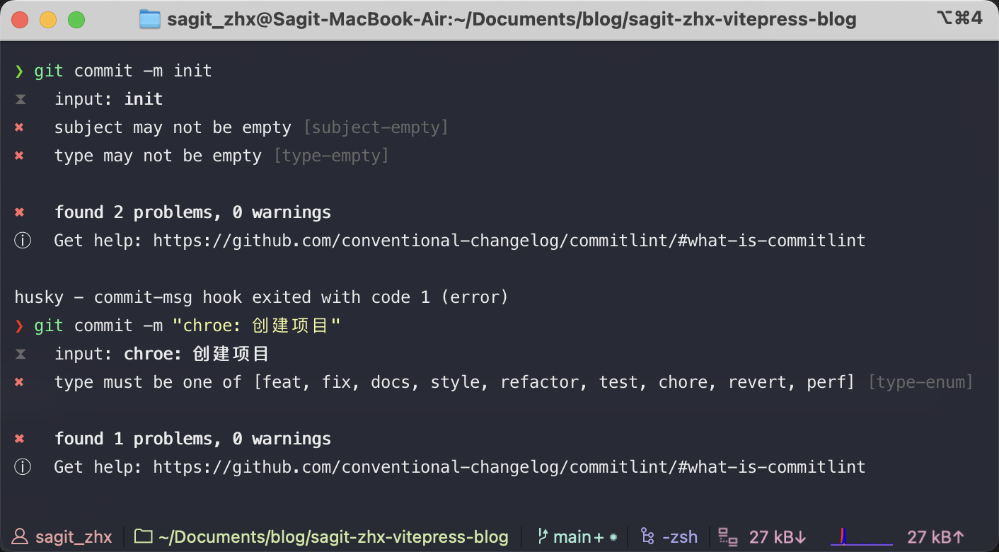

# Git Commit团队规范约束

> 使用 husky + commitlint 约束 `git commit`

## 安装 husky
> v7.1以上版本

```bash
# 1. 安装 husky
yarn add -D husky

# 2. 添加 script
npm set-script prepare "husky install"

# 3. 执行 script
yarn prepare
```

## 添加 commit-msg hook

commit message 的校验依赖于 `commitlint`
- `@commitlint/cli` 是用来在命令行中提示用户信息的
- `@commitlint/config-conventional` 是commit message规范
```bash
# 1. 安装
yarn add -D @commitlint/config-conventional @commitlint/cli

# 2. 配置 commitlint
echo "module.exports = {extends: ['@commitlint/config-conventional']}" > commitlint.config.js

# 3. 添加 hook
npx husky add .husky/commit-msg 'npx --no-install commitlint --edit "$1"'
```

至此，完成。

## 添加 eslint hook（可选）

```bash
# 前提是 package.json 中有 script lint
npx husky add .husky/pre-commit "npm run lint"
```

## 测试一下

若commit message不规范的话，将会报错并中断commit


## 参考配置
- `commitlint.config.js`
```javascript
// commitlint.config.js
module.exports = {
  extends: ['@commitlint/config-conventional'],
  rules: {
    'type-enum': [
      2,
      'always',
      [
        'feat',
        'fix',
        'docs',
        'style',
        'refactor',
        'test',
        'chore',
        'revert',
        'perf'
      ]
    ],
    'subject-full-stop': [
      0, 'never'
    ],
    'subject-case': [
      0, 'never'
    ],
    'header-max-length': [0, 'always', 72]
  }
};
```

## Git hook

| 文件                 | 执行时机                            | 描述                                                         |
| -------------------- | ----------------------------------- | ------------------------------------------------------------ |
| `pre-commit`         | `git commit` 执行前                 | 可以通过 `--no-verify` 绕过                                  |
| `commit-msg`         | `git commit` 执行前                 | 可以通过 `--no-verify` 绕过                                  |
| `post-commit`        | `git commit` 执行后                 | 不影响 `commit` 的结果                                       |
| `pre-merge-commit`   | `git merge` 执行前                  | 可以通过 `--no-verify` 绕过                                  |
| `post-merge`         | `git merge` 执行后                  | 在执行 `git pull` 时也会被调用                               |
| `prepare-commit-msg` | `git commit` 执行后，编辑器打开之前 | -                                                            |
| `pre-rebase`         | `git rebase` 执行前                 | -                                                            |
| `post-checkout`      | `git checkout` 或 git switch 执行后 | 如果不使用 `--no-checkout` 参数，则在 `git clone` 之后也会执行。 |
| `pre-push`           | `git push` 执行前                   | -                                                            |


## 提交规范

- `git commit message`提交规范可以参考阮一峰的 [Commit message 和 Change log 编写指南](https://www.ruanyifeng.com/blog/2016/01/commit_message_change_log.html)
- `VS Code` 可以使用 `Conventional Commits` 插件
